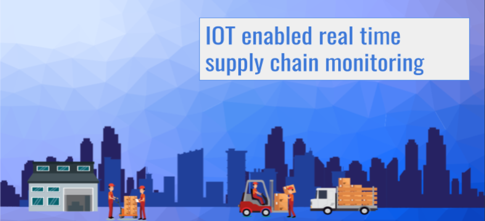

  

# IOT enabled real time supply chain monitoring

Supply chain mobile app for real time asset tracking written in 
  - Mobile App 
    - Dart (Flutter)
    - Firestore cloud
  - Web App
    - Flask     

Functionalities:
  - Authentication
    - Login/Register as a Manager/ Operator.     
  - Real time goods asset tracking
    - View temperature, humidity fluctuations; location and other details related to goods can be viewed based on unique identification of goods' RFID.    
  - Notifications and Alerts     
  - Billing    
  - Prediction of best supplier based on a ML Model.
  
    
# System Model

  

    
